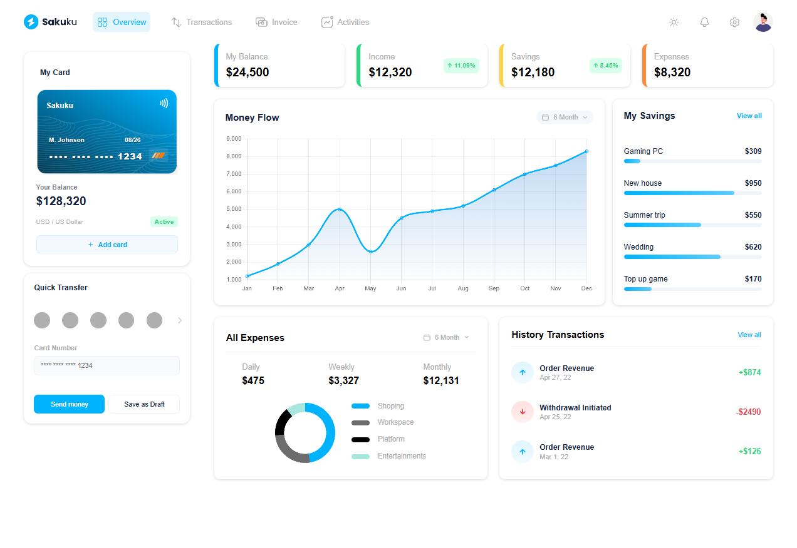
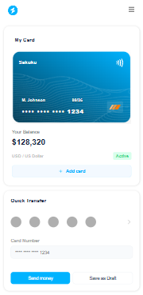

# Finance Dashboard

A responsive finance dashboard built with HTML, SCSS, and JavaScript. Features include expense tracking, revenue charts, and a mobile-friendly navigation.

**Inspired by:** [Figma UI Kit - Finance Dashboard](https://www.figma.com/design/Cps3N3zaySo9Cz9pSFnCMT/Figma-UI-kit---Finance-Dashboard--Community---Community-?node-id=6401-380&p=f&t=emt43vJuk2flbQr9-0)

## Screenshots

### Desktop


### Mobile


## Features

- Responsive design for desktop, tablet, and mobile
- Interactive charts using Chart.js
- BEM methodology for SCSS
- Hamburger menu for mobile navigation

## Technologies

- HTML5
- SCSS (Sass)
- JavaScript (ES6+)
- Vite
- Chart.js

## Getting Started

### Prerequisites

- Node.js (v16 or higher)
- npm

### Installation

1. Clone the repository:
   ```bash
   git clone https://github.com/your-username/finance-dashboard.git
   cd finance-dashboard
   ```

2. Install dependencies:
   ```bash
   npm install
   ```

3. Run the development server:
   ```bash
   npm run dev
   ```

4. Open [http://localhost:5173](http://localhost:5173) in your browser.

### Build for Production

```bash
npm run build
```

The built files will be in the `dist` folder.

## Deployment

This project is set up for automatic deployment to GitHub Pages using GitHub Actions. Simply push to the `main` branch, and the site will be deployed to `https://your-username.github.io/finance-dashboard/`.

## SCSS Architecture

- `src/scss/base/`: Reset, variables, and base styles
- `src/scss/blocks/`: Component-specific styles using BEM
- `src/scss/style.scss`: Main entry point importing all partials
